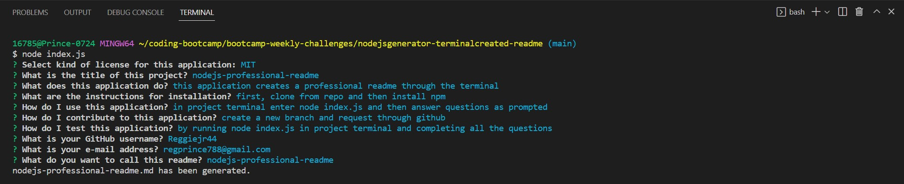

# nodejsgenerator-terminalcreated-readme

  ## License
  [MIT](https://opensource.org/licenses/MIT)

  ## Badges
  

  ## Table of Contents
  * [License](#license)
  * [Description](#description)
  * [Installation](#installation)
  * [Usage](#usage)
  * [How to Contribute](#how-to-contribute)
  * [Tests](#tests)
  * [Questions?](#questions)

  ## Description
  The project application creates a professional README file. You will be prompted with a list of questions
  By entering "node index.js" in the project terminal. By answering all of the questions given, you will then
  be presented with a professional README.

  ## User Story
  AS A developer
  I WANT a README generator
  SO THAT I can quickly create a professional README for a new project

  ## Acceptance Criteria 
  GIVEN a command-line application that accepts user input
  WHEN I am prompted for information about my application repository
  THEN a high-quality, professional README.md is generated with the title of my project and sections entitled Description, Table of Contents, Installation, Usage, License, Contributing, Tests, and Questions
  WHEN I enter my project title
  THEN this is displayed as the title of the README
  WHEN I enter a description, installation instructions, usage information, contribution guidelines, and test instructions
  THEN this information is added to the sections of the README entitled Description, Installation, Usage, Contributing, and Tests
  WHEN I choose a license for my application from a list of options
  THEN a badge for that license is added near the top of the README and a notice is added to the section of the README entitled License that explains which license the application is covered under
  WHEN I enter my GitHub username
  THEN this is added to the section of the README entitled Questions, with a link to my GitHub profile
  WHEN I enter my email address
  THEN this is added to the section of the README entitled Questions, with instructions on how to reach me with additional questions
  WHEN I click on the links in the Table of Contents
  THEN I am taken to the corresponding section of the README

  ## Screenshot of Application Terminal

  ## Link to video of use

https://clipchamp.com/watch/QOwnbbjsJ54
 

  ## Reach me here: 
  [Reggiejr44](https://github.com/Reggiejr44)  
  regprince788@gmail.com